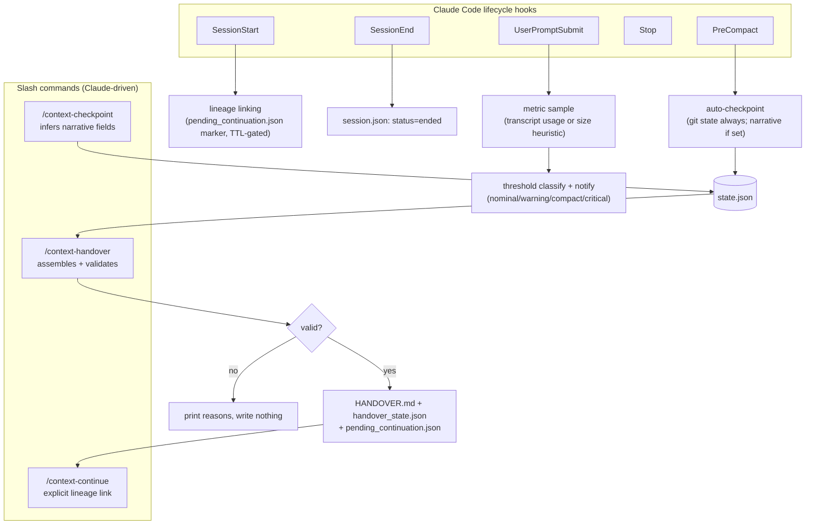

# Context Guardian

[](https://github.com/sumeetmi2/context-guardian/actions/workflows/ci.yml)

A Claude Code plugin that watches context/token pressure in a session and lets you generate a durable, structured **handover document** before things get cramped — so a fresh session (or a teammate) can pick up exactly where you left off, without you re-explaining everything from scratch.

It observes, estimates, and hands you a ready-to-use continuation doc on request, tracking the chain across sessions so a long-running task stays traceable. It does **not** auto-compact or auto-start new sessions for you in the interactive CLI — see [Non-goals](#non-goals) below.

## Why

Long Claude Code sessions eventually hit context limits. `/compact` helps, but compaction is lossy, and there's no built-in way to hand off an in-progress task to a brand-new session without losing the thread — objective, decisions made, what's been tried, what's next. Context Guardian's job is to make that handoff explicit, deterministic, and reviewable, instead of relying on memory or an ad-hoc summary at the worst possible moment (right when context is already tight).

| | `/compact` | Ad-hoc summary | Context Guardian |
|---|---|---|---|
| Continues the same session | Yes | No | No |
| Starts a fresh, uncluttered context | No | Yes | Yes |
| Structured next action | Not guaranteed | Not guaranteed | Required (validation fails without one) |
| Git state captured | No | Usually no | Yes, deterministically |
| Redacted before writing to disk | No | Usually no | Yes (best-effort, pattern-based) |
| Validated before being trusted | No | No | Yes |
| Session lineage tracked | No | No | Yes |

## What it does

- Tracks context usage every turn from the transcript's real per-turn API usage numbers (labeled `actual`/`high confidence`); falls back to a transcript-size heuristic (`estimated`/`low confidence`) only if a real usage record can't be found.
- Classifies usage against configurable thresholds (`nominal` → `warning` → `compact` → `critical`) and surfaces a recommendation inline.
- Writes a checkpoint automatically right before compaction happens (`PreCompact` hook) — this captures deterministic repository state (git branch/diff/changed files) unconditionally; narrative fields (objective, next action, etc.) are only as complete as your last `/context-checkpoint`, since a hook can't itself infer them. Guardian nudges you to run one if none was set.
- On request, generates `HANDOVER.md` + `handover_state.json`: objective, decisions (tagged confirmed/inferred/user-provided/unverified), files touched, git state, remaining work, and — critically — a single **next action**, so the next session has an unambiguous starting point.
- Redacts known credential shapes (AWS keys, GitHub/Slack tokens, private key blocks, bearer tokens, etc.) from the handover before it ever touches disk.
- Refuses to write a handover that's missing a next action, over a token budget, or still contains a detected secret — validation failure prints the reason instead of silently producing a broken doc.
- Links each new session to the one it continued from, so `/context-guardian:context-lineage` can trace a long task back through however many handovers it took. Auto-linking only fires within 30 minutes of the handover that generated it (a single-use marker, not "any prior handover in this repo"); after that, or from a different terminal, link explicitly with `/context-guardian:context-continue <handoverId>`.

## Non-goals

- **No automatic compaction.** There's no supported way for a hook to trigger `/compact` in an interactive session — Context Guardian tells you to run it, it doesn't run it for you.
- **No automatic rollover in the interactive CLI.** Hooks can't start a new session on your behalf there. A headless/Agent-SDK wrapper *can* — see [`docs/PHASE3_SDK_ROLLOVER.md`](docs/PHASE3_SDK_ROLLOVER.md) for a reference implementation, opt-in and separate from the hook-driven plugin.
- **No fabrication.** Narrative fields (objective, decisions, plan) are never guessed — they render as "not recorded" until you (or Claude, acting on your behalf) explicitly set them.
- **No secret-detection guarantee.** Redaction is pattern-based and best-effort against known credential shapes, not a security boundary.
- **No guarantee of real usage.** Usage is read from the transcript's real per-turn API accounting when available (`actual`/`high confidence`); if that record can't be found, it falls back to a transcript-size heuristic (`estimated`/`low confidence`) — see `monitoring.contextWindowTokens` below if the denominator still looks off.

## Install

**Option A — marketplace install (recommended, works from any project, persists across sessions):**

```bash
claude plugin marketplace add sumeetmi2/context-guardian
claude plugin install context-guardian@context-guardian
```

That's it — the plugin is now active in every Claude Code session, in any directory.

**Option B — load for one session only, no install:**

```bash
git clone https://github.com/sumeetmi2/context-guardian.git
claude --plugin-dir ./context-guardian
```

See [`docs/TUTORIAL.md`](docs/TUTORIAL.md) for a full walkthrough including troubleshooting.

## Quick example

```
$ claude --plugin-dir /path/to/context-guardian
> /context-guardian:context-status
Session: 6736435e-6ebb-4f77-a0d4-0d561152cfb3
Context: approximately 3.7% (actual, high confidence)
Status: nominal — no action required
Turns: 1
Compactions this session: 0
Last checkpoint: none yet — run /context-checkpoint
```

## Sample handover

`/context-guardian:context-handover` produces something like this (trimmed):

```markdown
# Session Handover

## Identity
- Handover ID: cg-72921739c744
- Parent session ID: s1
- Session lineage ID: cg-72921739c744
- Created time: 2026-07-23T14:49:35+00:00
- Repository: /path/to/repo
- Branch: main
- Commit: a1b2c3d

## Objective
Migrate the billing service off the deprecated v1 webhook format.

## Decisions made
- [confirmed] Retries handled via Resilience4j, not custom retry code.
- [inferred] The v1 format is only referenced in webhook_handler.py and its tests.

## Files changed
- src/billing/webhook_handler.py
- tests/test_webhook_handler.py

## Remaining work
- Update the integration test fixture to use v2 payload shape.
- Re-run the full billing test suite before merging.

## Next action
Run `pytest tests/test_webhook_handler.py -k v2` and fix the failing fixture.
```

Full sections also include: current status, constraints, repository context, files inspected, git state, commands executed, validation status, evidence and references, open questions, risks and caveats, user communication state, and do-not-repeat notes — see `lib/handover.py` for the exact schema.

## Commands

The three you'll use day to day:

| Command | What it does |
|---|---|
| `/context-guardian:context-status` | Show current session's estimated usage, status, turn/compaction counts |
| `/context-guardian:context-checkpoint` | Manually write a checkpoint (objective, decisions, next action, etc.) |
| `/context-guardian:context-handover` | Generate + validate `HANDOVER.md` for continuing in a new session |

Less common, administrative:

| Command | What it does |
|---|---|
| `/context-guardian:context-lineage` | Show the chain of sessions this one was continued from, if any |
| `/context-guardian:context-continue` | Explicitly link this session as a continuation of a prior handover |
| `/context-guardian:context-config` | View or update effective config (`key.path=value`) |
| `/context-guardian:context-disable` | Turn monitoring off/on for this project |

## Configuration

Precedence: CLI overrides > project config (`.claude/context-guardian.json`) > user config (`~/.claude/context-guardian.json`) > defaults.

```jsonc
{
  "monitoring": {
    "warningThresholdPercent": 72,
    "compactThresholdPercent": 84,
    "criticalThresholdPercent": 92,
    "renotifyAfterTurns": 8,
    "contextWindowTokens": null
  },
  "handover": {
    "maximumTokens": 5000
  },
  "rollover": {
    "mode": "off"
  },
  "security": {
    "redactBeforeStateWrite": true,
    "persistCommands": true,
    "persistEvidence": true
  }
}
```

`renotifyAfterTurns` controls notification hysteresis: once past `warning`, you're renotified on any status change, or every N turns as a reminder — not every single turn. `rollover.*` is read by the Phase 3 Agent-SDK wrapper reference, not by the hooks — see [`docs/PHASE3_SDK_ROLLOVER.md`](docs/PHASE3_SDK_ROLLOVER.md).

`contextWindowTokens` is the denominator for the usage percentage. `null` (default) falls back to a rough constant (`lib/metrics.py`) since hook stdin doesn't expose the real window size — set it explicitly to match your actual context window (check `/context` in Claude Code) for an accurate percentage: `/context-guardian:context-config monitoring.contextWindowTokens=967000`.

Set project-scoped values with `/context-guardian:context-config monitoring.warningThresholdPercent=60`.

`security.redactBeforeStateWrite` (default `true`) applies the same pattern-based redaction used on the rendered handover to every narrative field the moment it's written to `state.json`/`handover_state.json` — not just the final markdown. `persistCommands`/`persistEvidence` (default `true`) let you exclude `commandsExecuted`/`evidence` from disk entirely for stricter setups. None of this makes redaction a security boundary — see [Non-goals](#non-goals).

## How it works

Five Claude Code hooks (`SessionStart`, `UserPromptSubmit`, `PreCompact`, `Stop`, `SessionEnd`) call a single Python CLI (`bin/cg.py`) that reads/writes plain JSON under `.claude/context-guardian/` in your project (gitignored by default). No background process, no daemon, no non-stdlib dependencies.



```
lib/
  metrics.py      real usage from transcript API records, heuristic fallback
  thresholds.py   classify usage, recommend an action
  gitstate.py     deterministic git state capture (subprocess, no inference)
  checkpoint.py   pre-compaction / manual checkpoint state
  handover.py     builds + validates HANDOVER.md
  redact.py       pattern-based secret redaction
  config.py       config precedence and merging
  store.py        atomic JSON/event-log persistence, session lineage chain
  rollover.py     rollover-trigger decision for Agent-SDK wrappers (Phase 3)
```

## Development

Zero external dependencies — everything runs on the Python 3 standard library.

```bash
python3 -m unittest discover -s tests -t . -v
```

## Roadmap

Usage signals, notification hysteresis, headless/Agent-SDK rollover, session lineage, ruff/mypy, and CI are all shipped — see [`CHANGELOG.md`](CHANGELOG.md) for what changed and when.

Still open:

- Pluggable metric providers (native context-percentage source, once/if the hook payload exposes one) beyond transcript-usage and the size heuristic.

## Contributing

Issues and PRs welcome at [github.com/sumeetmi2/context-guardian](https://github.com/sumeetmi2/context-guardian). See [Development](#development) above to run the tests before submitting.

## License

MIT — see [LICENSE](LICENSE).
