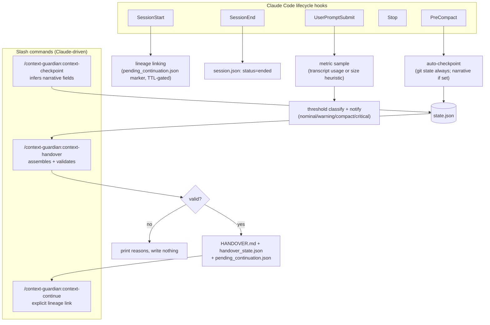

# Architecture

Five Claude Code hooks (`SessionStart`, `UserPromptSubmit`, `PreCompact`, `Stop`, `SessionEnd`) call a single Python CLI (`bin/cg.py`) that reads/writes plain JSON under `.claude/context-guardian/` in your project (gitignored by default). No background process, no daemon, no non-stdlib dependencies.



## Modules

```
lib/
  metrics.py      real usage from transcript API records, heuristic fallback
  thresholds.py   classify usage, recommend an action
  gitstate.py     deterministic git state capture (subprocess, no inference)
  checkpoint.py   pre-compaction / manual checkpoint state
  handover.py     builds + validates HANDOVER.md
  redact.py       pattern-based secret redaction
  config.py       config precedence and merging
  store.py        atomic JSON/event-log persistence, session lineage chain
  rollover.py     rollover-trigger decision for Agent-SDK wrappers (Phase 3)
```

## On-disk layout

Per project: `.claude/context-guardian/sessions/<session-id>/` holds `session.json` (identity, lineage links, turn/compaction counters), `state.json` (the current checkpoint), `events.jsonl` (append-only event log), and — once a handover has been generated — `HANDOVER.md` and `handover_state.json`. A single `.claude/context-guardian/pending_continuation.json` at the project root holds the short-lived, single-use auto-link marker described in the README's lineage section.

## Identity fields

Each handover carries four distinct IDs, all minted/tracked in `lib/handover.py`:
- **Handover ID** — unique per generated handover; a session that runs `/context-guardian:context-handover` twice gets two different handover IDs.
- **Lineage ID** — stable across an entire chain of continued sessions; every handover in the same chain shares it.
- **Source session ID** — the session that generated this specific handover.
- **Parent handover ID** — the handover ID this session's lineage continued from (`none` for a root session).

## Development

Zero external dependencies — everything runs on the Python 3 standard library.

```bash
python3 -m unittest discover -s tests -t . -v
ruff check .
mypy lib bin
```
